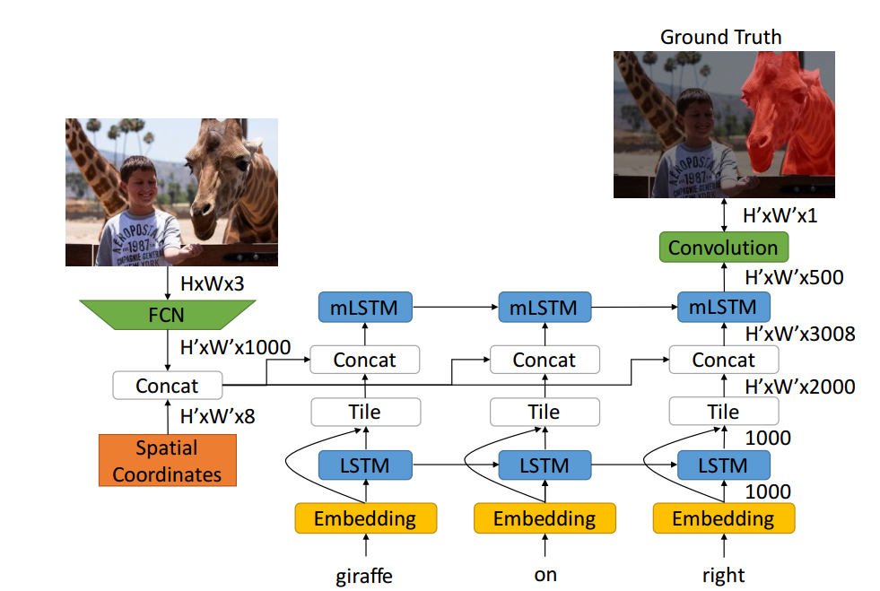
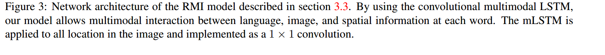
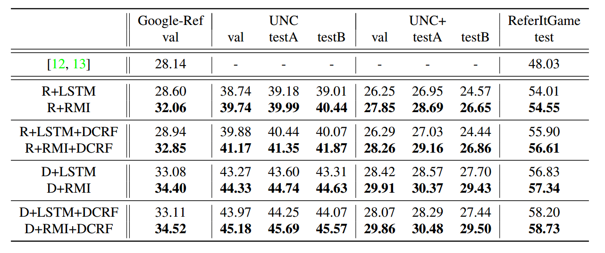

## Problem Statement

The problem statement is to segment out visual object from natural language query. Semantics of that visual object are defined from NLP query. For ex. `Man in pink shirt` in some image, we want to segment out corresponding region where any/all man is wearing pink shirt.

## Related Works and Inspiration

Right now this problem is addressed in academia by extracting out image features separately from Deep Convolution Neural Network and language features from LSTM cells. These features are then concatenated together to form a fused representation of image and query. This fused representation is somehow used to predict corresponding segmented region with trivial loss function. 

What authors feel is we, human don't perceive things is similar manner like LSTM, we don't remember everything after the last loop over word embeddings. In author words: 

> For example, consider the expression “the man on the right wearing blue”. Without seeing an actual image, all information in the sentence needs to be remembered, meaning the sentence embedding needs to encode IS MAN, ON RIGHT, WEAR BLUE jointly. However, with the actual image available, the reasoning process can be decomposed as a sequential process, where the model first identifies all pixels that agree with IS MAN, then prunes out those that do not correspond with ON RIGHT, and finally suppresses those that do not agree with WEAR BLUE.

This task is also similar to visual question answering task where you need to generate answer(NLP) based on an image and a question. The difference only is, in VQA, we need sequence generation(in answer) while here we need to produce segmentation mask at once.  

Authors achieve this by applying LSTM in a convolution manner.

## Key Contributions

>- We propose a novel model, namely convolutional multimodal LSTM, to encode the sequential interactions between individual semantic, visual, and spatial information.
>- We demonstrate the superior performance of the word to-image multimodal LSTM approach on benchmark datasets over the baseline model.
>- We analyze the intermediate output of the proposed multimodal LSTM approach and empirically explain how this approach enforces a more effective word-toimage interaction.

**Basically they want to convert this referring image segmentation into an sequential process.** 

## Model

Here concatenation of visual features and spatial features with language features is fed to `mLSTM` cell as an input and `mLSTM` cell produces an output for same. SInce mLSTM receives multimodal data, we can understand this as a 1x1 convolution applied to fused features .

>The same mLSTM operation is shared for all image locations. This is equivalent to treating the mLSTM as a 1×1 convolution over the feature map of size W 0 × H0 × (DI + DS + 8). In other words, this is a convolutional LSTM that shares weights both across spatial location and time step.

## Results

## My Takeaways

- This idea of treating this problem as sequential problem is innovative and having an mLSTM cell to encode both visual and linguistic features is also good. This gives model ability to forget all those pixel which defy correspondence initially.
- My guts are that this kind of model would work good even where there are small objects because at each time step there would be a reduction/change of probable pixels for segmentation.
- I still believe that this essentially is fusing of features from image and language just more diffused!

- I want to study good papers on VQA as they can provide me with good literature and insights on this task.
