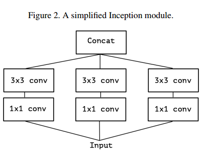
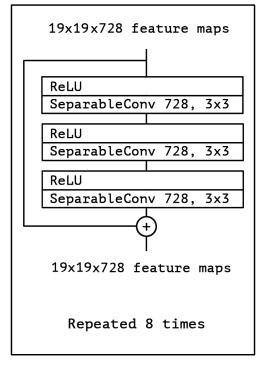

[Paper Link](https://arxiv.org/abs/1610.02357)

### Previous Works and Inspiration

- While Inception modules are conceptually similar to convolutions, the empirically appear to be capable of learning richer representations with less parameters. 
- A convolution layer attempts to learn filters in a 3D space, with 2 spatial dimensions (width and height) and a channel dimension; thus a single convolution kernel is tasked with simultaneously mapping cross-channel correlations and spatial correlations.

- In Inception module, we introduce 1x1 convolutions instead of 3 or 5 to extract fewer channels and focus on spatial information. After that mapping all correlations in these smaller 3D spaces.
- In theory, cross channel correlations and spatial correlations are decoupled in Inception module.

### Separable Convolution Layer

So essentially the idea of inception of separating cross channel mapping and spatial mapping was already there as a layer in Tensorflow as "Separable Conv" Layer.

Main difference between this and Inception version is :

- The order of the operations: depthwise separable convolutions as usually  implemented (e.g. in TensorFlow) perform first channel-wise spatial convolution and then perform 1x1 convolution, whereas Inception performs the 1x1 convolution first.(doesn't have a difference as both are stacked)

- The presence or absence of a non-linearity after the first operation. In Inception, both operations are followed by a ReLU non-linearity, however depthwise separable convolutions are usually implemented without non-linearities. 

 ### Key Contributions

-  Author say that we can totally decouple cross channel correlations and spatial correlations in the feature maps of convolution neural network.
- Parameters are almost same in Inception and Xception model while Xception outperforms by a large margin on a dataset with large number of classes(17k).

- Rest all things are same, just replacing inception module by depthwise separable conv layer block also making the architecture simple.

## Takeaway

Idea of decoupling of channel dimension and spatial feature mapping from convolution kernel is great! So deciphering it mathematically:

We know each channel in Convolution block represents some high level feature say in human, each channel would map a body part(just for example!). Then this idea of  depthwise conv proposes that in process of identifying one body part don't process info from other body part info, it would disturb the signal in processing.

After we get good signal info body part, then we can use info from others to get high level part info.