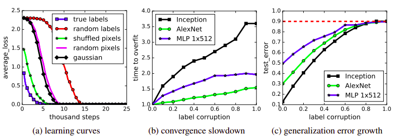

[Paper Link](https://arxiv.org/abs/1611.03530)

### Generalisation in Machine Learning Models 

In Supervised Machine Learning, we train the model on training set and evaluate the model on a validation/testing set which is unseen during the training process. It is assumed that the data distribution is same for training and testing set.

So, basically our goal for a **good** Machine Learning model is to **generalise** well from training data to any data from the problem domain.

**generalisation** refers to how well a machine learning model learns and generalises to a new data avoiding Over-fitting and Under-fitting.

**generalisation Error** refers to difference between Training error and Testing error. Increases with over fitting.

## Key Findings from Paper

As of now, we understand that if a model is big(large parameter space), it tries to over-fit training data and we need explicit regularisation(l2 norm on parameters, data augmentations, weight decay, Early Stopping) to decrease Generalisation error. 
**But** this paper has shown that SOTA image classification models easily fit on random labelling of training data or even when true pixels are replaced by random pixels. This process is unaffected by explicit regularisation.

By their experiments, they show that if size of Deep Neural Networks is greater than sample size(which usually happens), Neural Networks are able to capture meaningful signal in the data, **while at the same time fit the noisy part using brute-force.** This is also unaffected by hyper-parameter tuning, same set of hyper-parameters converges for noisy labelled data too.

### Effective Capacity of Neural Network

They have shown with their experiments that generalisation error not only depend on explicit regularisation and optimizer but on model architectures as well. 

Also, random noisy image pixels are easy to over-fit compared to true images as random images are well separated in pixel space than original one.

### Traditional bound for Generalization

Theoretically, we have VC dimension and Rademacher complexity to measure capacity of Classification model. But authors from their results showed that regularisation bound achieved theoretically is of no use in realistic settings. 

Similar is the case with evaluation of robustness of training algorithms. Namely Uniform Stability, which doesn't take data into account just algorithm and it's difficult to utilise this stability notion.

## Finally Role of Regularisation

With experimenting on different architectures on namely 3 explicit regularisation - data augmentation, weight decay and Dropout authors concluded that:

- Regularisation is important, but we can achieve more by just changing the architecture of model.
- Regularises are not only responsible for generalisation capacity of deep nets.
- Early Stopping could potentially improve generalisation performance.
- Batch Norm give marginal gains on generalisation error.
- Model could perform well even after regularises are removed.

### Expressive Power of NNs

Authors chose a different approach than traditional approach of showing what functions of entire domain can or can't be represented. They show expressive power on a finite sample of size $n$. 

In their words, "There exists a two-layer neural network with ReLU activation and $2n+d$ weights that can represent any function on a sample of size $n$ in $d$ dimensions"

### Implicit Regularisation

They have theoretically shown that in linear models, SGD often converge to solution with minimum norm. And minimum norm doesn't predict anything about generalisation performance.

Doing simple tricks like preprocessing with some conv layers, gaussian kernels on pixels improve generalisation error which pose serious questions on traditional generalisation understanding.

"This shows that the reasons for why optimization is empirically easy must be different from the true cause of generalisation"

