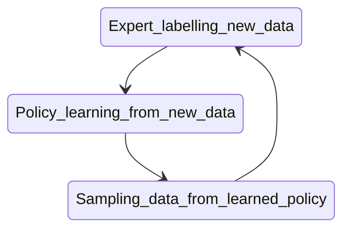

Jude is a football player, a noob but a wannabe great player. Jude is a die-hard fan of Christiano Ronaldo and watches every time Ronaldo is playing somewhere. 

Jude wondered if he could just be like Ronaldo, exactly like Ronaldo. If by humongous practice, he could **imitate** all skills Ronaldo has. He doesn’t care that while imitating, he is scoring a goal or not, he would just kick as Ronaldo would have kicked. 

> If I would kick exactly like Ronaldo, it would definitely be a goal!

Jude was fascinated by this idea, but also he was **too lazy** and **loved programming**(eternal bond). He thought why couldn’t he do something very similar in the virtual world, after all, he could fast forward this training process as he controls this virtual world. 

Jude stumbled upon exactly what he was looking for

### Imitation Learning

Continuing Jude's story, as he watches Ronaldo a lot, he knows what Ronaldo would do in numerous situations thrown at him. Let’s say Jude has practised and can mimic exactly Ronaldo in those **exactly the same situations**. 

As the number of situations Ronaldo(or any football player) can be in is infinite, Jude can’t cover all, how hard he tries! And since Jude was so busy in replicating Ronaldo, he didn’t learn anything when an unseen situation arises. Also, since Jude is human just like us, there is nothing like **exactly like** Ronaldo.

However hard he try, there would be some scope of mistake every time!

We would see above circumstances projected mathematically later.

> We can be wrong, or we can know it, but we can’t do both at the same time

If you understood Jude, you got Imitation learning. :smile:

### Different Learning Paradigms

Let us quickly define three verticals of machine learning which would help define our problem statement.

- Supervised learning: Basically Find xs and ys, define a model and fit model to predict ys.
- Unsupervised learning: We wish to inherently learn the structure of data without **explicitly** using labels. 
- Reinforcement learning: It's about taking suitable actions in order to maximize reward in an environment. 

### Now Why Imitation Learning?

Now consider that Jude won't use Imitation learning as of now and want to train himself for every situation with objective being shooting a goal using Reinforcement learning. 

In RL setting, reward for shooting a goal would be **+1** and for rest it would be **0**. As you know, this kind of reward is very sparse in nature. There may be handful of time where agent(Jude in our case!) would receive a positive reward to learn from.   

> The reward sparsity is one of the issues that hinders us in beating Montezuma’s Revenge — a notoriously hard Atari 2600 game, that has not been cracked yet.

Another issue is one we discussed above, we need virtual simulators to fasten this process of learning but what if we don't have one or we want to learn something in real life?

Imitation learning can potentially solve these problems and also a bunch of others.



### How Imitation learning?

Generally, Imitation learning is useful when it is easier for an expert to demonstrate the desired behaviour so that we don't have to specify any reward function.

Let's say we collect expert demonstrations (also known as trajectories in RL setting) 

$\tau$ = (s0, a0, s1, a1.....) where actions (As) are based on expert's policy(say human brain).  In some cases, we may require presence of "**expert**" during training. 

Once we get this trajectory, we slice this on each time step to get pairs of Ss and As. 

We then treat these pairs as i.i.d examples and apply **Supervised learning**. 

Changin loss function and optimisation strategies in this learning define various imitation learning algorithms. Let's look at basic ones in them.

### Behaviour Cloning 

 This is simplest form of imitation learning where you treat these pairs(Ss, As) as i.i.d examples and apply simple supervised learning. We can choose the model to a tree based (Random Forest, Gradient Boosting) or Neural Networks depending on complexity of state and action space. 

###### Enough of talks, let's see implementation!

You can head over to this folder : https://github.com/Shivanshmundra/reinforcement_learning_beginner/tree/master/imitation_learning_bc

Here, you can run `expert_recorder.py` to record expert demonstrations, expert being you!. Right now it uses `MountainCar-v0` environment where you have only 2 actions - right or left, to climb a mountain. You can guide by using `a` and `d` for right and left respectively. You can change environment according to your ease too!

Once you have created "expert demonstrations",  you can build a model and train on collected data. Trained policy then can be used to test on same environment. 

Extensive instructions are in `README` of folder. Also, I have borrowed this code, so to get good understanding of code, you can watch [this](https://www.youtube.com/watch?v=0rsrDOXsSeM&feature=youtu.be&t=1370) video. 

Once trained, it looks something like this: 



##### Shortcomings

In some cases, Behavioural cloning can work excellently, precisely where there are limited number of states and time frame of an episode is very short. 

Main reason for Behaviour cloning to not work generally is the i.i.d assumption we took above for supervised learning, while in real scenario like an MDP(Markov Decision Process) an action induces the next state, which breaks i.i.d assumption.

Also, as you know this algorithms is only trained on given states as we previously talked that no machine learning algorithm is 100% accurate, there is a chance of error on some time step $t$ and this error will keep on increasing with $t$ as with every wrong decision, agent might fall into an "more unknown" state thus prone to make more error.

In above cases, BC behaviour is undefined and can lead to catastrophic failures. 

​					*Source : https://web.stanford.edu/class/cs234/slides/lecture7.pdf*

### DAgger (Dataset Aggregation) Algorithm

This is basically an improved version of Behaviour cloning algorithms we discussed above. 

Primary shortcoming of BC was that the data it had for training was static and agent could lead to unknown states where it doesn't have expert demonstrations. 

We could improve that by keeping expert in loop of training and querying expert in each loop to collect more data.

The DAgger algorithms works as follows:

- Initial policy: $\pi$ 0 
- For m = 1:
  - Collect trajectories $\tau$ sampled from policy $\pi$m-1 
  - Estimate state distribution by discarding actions from $\tau$.
  - Ask expert to label/feedback on those states interactively.
  - Creating union of data collected till now  $\tau$1,2,...m  
  - Training $\pi$ on this union of data

DAgger is very efficient method, which doesn't have shortcomings of Behaviour cloning algorithm. The only limitation of this method is the fact, that we need an expert that can evaluate the agent’s actions at all times, which is not possible in some applications.

#### Let's see implementation of DAgger

I have used code from Sergey Levine's [CS285 Deep Reinforcement Learning course](http://rail.eecs.berkeley.edu/deeprlcourse/) material. If you want to dive deep into Deep Reinforcement learning, it's a gold  mine!

Head over to my github repository - https://github.com/Shivanshmundra/CS285-DeepRL-Solutions/tree/master/hw1 for DAgger implementation on different gym environments. 

In this solution, instead of human expert labelling state space, we have an expert policy which when queried, induce actions on given states. You can see with every iteration of Data Aggregation, episodic reward increases and agent approach towards convergence. 

This repository also contain implementation of Behaviour cloning to compare between BC and DAgger algorithm. 

Some of trained policies on different environments:







In all above simulations, on the left is trained policy using **DAgger** algorithm and on right is expert policy which was used during training.

--- 

### Other Algorithms

All algorithms explained above are cateegorised as "basic" algorithms in Imitation learning. There are several other algorithms to discuss but I haven't understood them completely. 

Some of them are:
- **Inverse Reinforcement Learning(IRL)** :
  - Learns the reward function from expert trajectorie, then derives optimal policy.
  - It's very expensive to run.
  - Indirectly learns optimal policy from reward function.

- **Generative Adversarial Imitation Learning(GAIL)** : 
  - It learns the policy, not the reward function from data.
  - Sometimes, it's better than "expert" policy.
  - Idea is inspired from Generative Adversarial Networks, where we need to approximate ground truth probability distribution.
  - Here we need to approximate "expert" state-action distribution. 
  - The goal is to find a policy pi-theta such that the discriminator cannot distinguish between states following the pi-theta as opposed to those from pi-expert.

--- 

So this was a detour of Imitation Learning, Hope you found it insightful! I would love to hear feedback, if any. :heart:

--- 
### References
- https://medium.com/@SmartLabAI/a-brief-overview-of-imitation-learning-8a8a75c44a9c
- http://rail.eecs.berkeley.edu/deeprlcourse/
- https://github.com/Shivanshmundra/CS285-DeepRL-Solutions/tree/master/hw1
- https://hollygrimm.com/rl_gail
- https://medium.com/@sanketgujar95/generative-adversarial-imitation-learning-266f45634e60
- https://medium.com/@jonathan_hui/rl-imitation-learning-ac28116c02fc